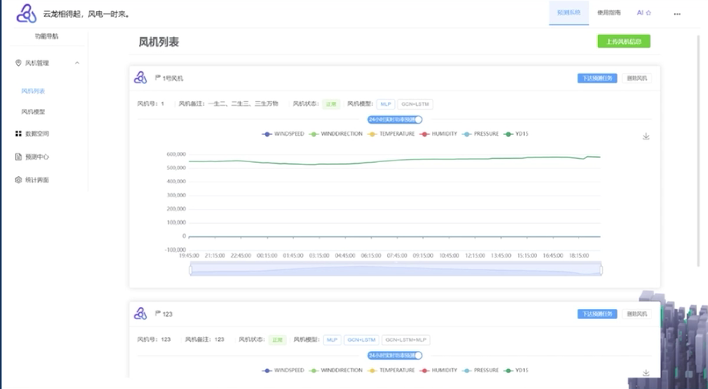
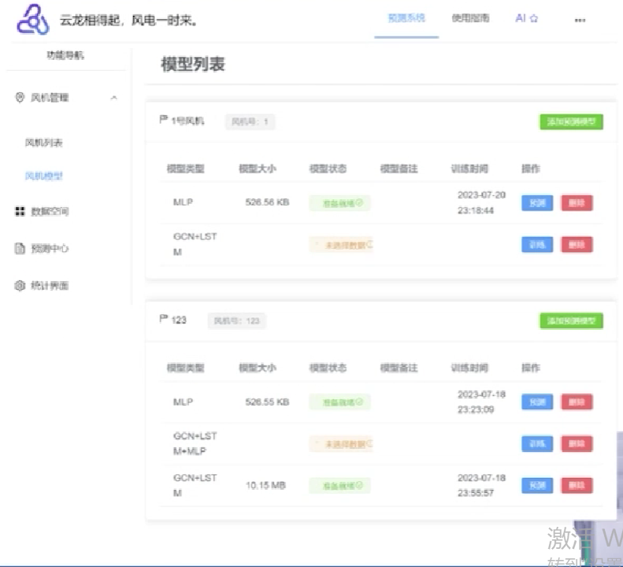
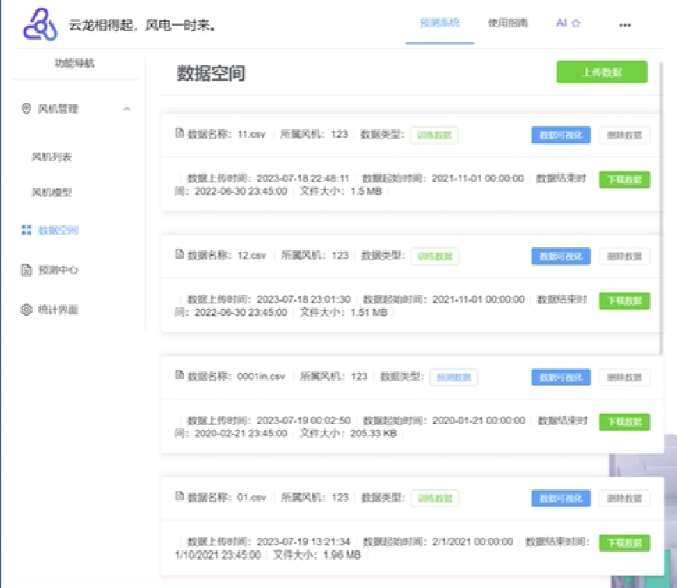
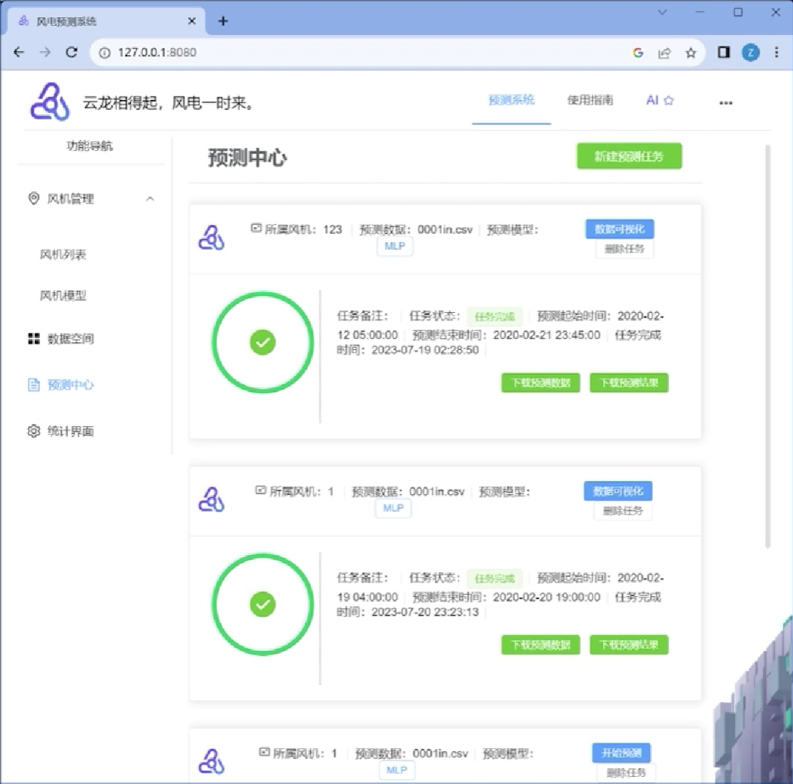
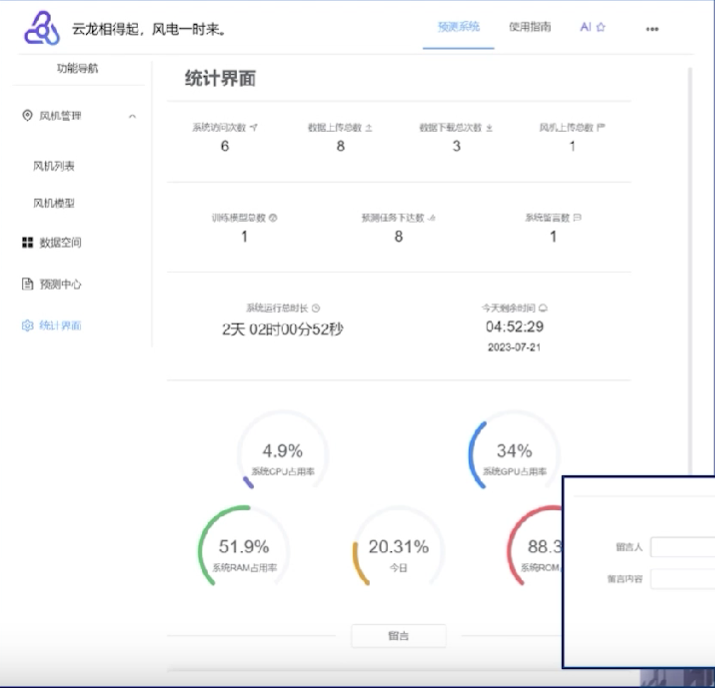
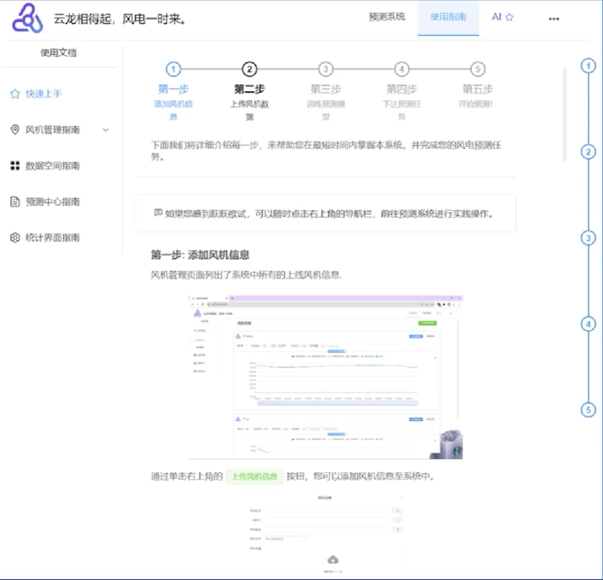
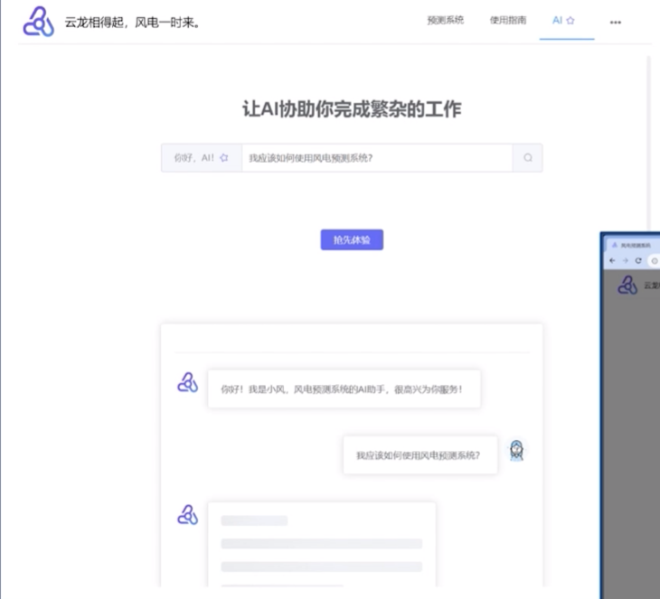
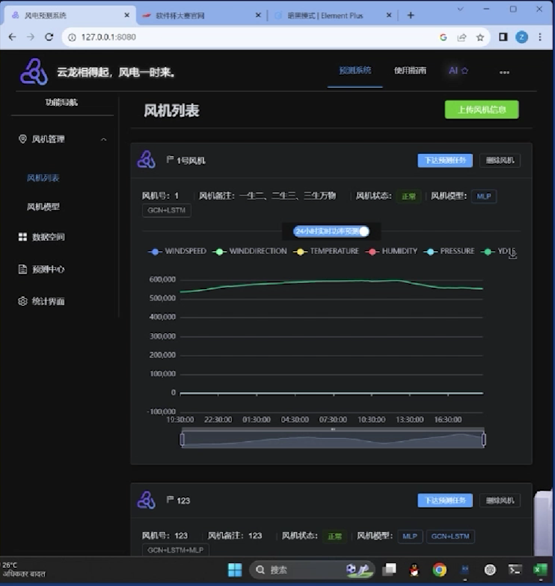
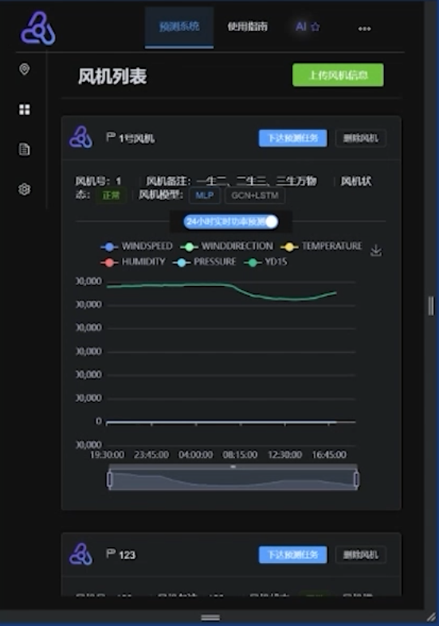

<div align="center">


---

<h1> 云龙风电 </h1>

### TCN+LSTM+MLP实时风电预测网站

[](https://github.com/TochusC/ai-assistant-teaching-website)
[](https://github.com/TochusC/ai-assistant-teaching-website)

[](https://github.com/TochusC/ai-assistant-teaching-website)


[**简体中文**](./README.md)


[”中国软件杯“大学生程序设计竞赛](https://www.cnsoftbei.com/)-A04基于龙源风电数据的风电实时预测系统-竞赛作品-国家三等奖

前端Vue3，后端Django，TCN+LSTM+MLP神经网络使用[PaddlePaddle](https://www.paddlepaddle.org.cn/)深度学习框架搭建。
</div>

---

## 项目框架🛠️

```angular2html
├── WPF_Backend # 后端Django项目
│   ├── WPF_Backend # Django应用

├── wpf_frontend_ts # 前端TypeScript Vue3项目
│   ├── public # 静态资源
│   ├── src # 源代码
│   ├── assets # 静态资源
│   ├── components # 组件
│   ├── views # 页面
│       ├── TurbineList # 风机列表
│       ├── DataSpace # 数据空间
│       ├── ForecastCenter # 预测中心
│       ├── ForecastModel # 预测模型
│       ├── AboutUs # 关于我们
│       ├── UserGuide # 用户指南
│       ├── PlayWithAI # AI助理页面
│       ├── StatisticsInterface # 统计界面
```

## 项目介绍📱

---

### 三大页面

云龙风电-风电实时预测系统分为三大页面：预测系统页面，使用指南页面与AI助理页面。
其中预测系统页面负责了风电实时预测系统的主要功能职责。

### 四大功能模块

云龙风电-风电实时预测系统分为四大功能模块：风机管理模块，数据空间模块，预测中心模块，统计界面模块。

## 项目预览💻

---

### 风机列表页面


风机列表页面会列出了目前系统所有上线风机的相关信息，并对风
机未来24小时功率进行实时预测，用户可在该页面完成上传
新风机信息或删除已有风机信息，以及布置预测任务等操作。

### 预测模型页面


预测模型页面会列出所有上线风机所具有的预测模型信息
在该页面可为已上线风机添加新模型并已有模型进行训练、预测、
删除等操作。

### 数据空间页面

数据空间页面列出了系统中所有储存的数据，数据包含有模型训练用
的预测数据，以及功率预测用的预测数据，用户可在此页面
进行数据可视化及上传、下载功能。


### 预测中心页面

预测中心页面会列出目前系统中所有已下达预测任务及相关信息
在该页面可下达新的预测任务，下载任务的预测数据及预测
结果文件，以及对已完成任务进行数据可视化或删除任务等
操作。

### 统计数据页面

统计数据页面会列出目前系统中所有统计数据，包括系统所含数据
数，系统上线风机数，以及系统负载情况，帮助管理人员更
好地控制及监测系统状况。

### 使用指南页面


使用指南页面提供了风电预测系统的使用指南，指南详细介绍了风
电预测系统的使用方法，帮助管理人员无门槛快速上手风机
预测系统的使用，并应用本系统来快速完成风机预测任务及
数据可视化功能

### AI助理页面


AI助理页面提供了风电预测系统的AI助理功能，AI助理会根据用户
的输入信息，为用户提供相关的风电预测信息，帮助用户更好地
了解风电预测系统的使用方法，以及风电预测系统的相关功能。

### 深色模式与响应式布局


